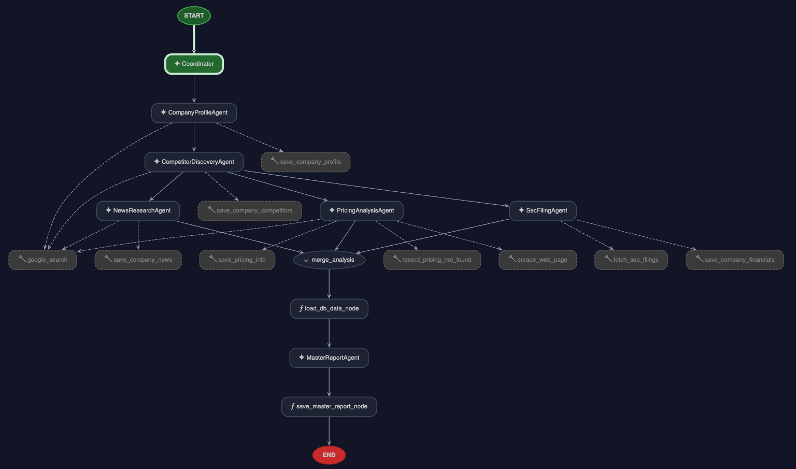

# 📈 Competitive Intelligence Assistant



A unified, multi-agent competitive intelligence application powered by Google Antigravity (AGY) and the Agent Development Kit (ADK). This system gathers corporate profiles, SEC filing metrics, competitor pricing, and recent announcements to generate strategic master reports, and includes an interactive AI Market Copilot chat dashboard.

---

## 📁 Project Directory Structure

The repository is consolidated into a single unified directory housing the agent definitions, the FastAPI backend, and the Nuxt.js frontend dashboard:

```
competitive-intelligence-agent/
├── app/                  # Core Agent Logic & Workflows
│   ├── agents/           # Individual LLM Agent definitions (Small vs. Large)
│   ├── app_utils/        # Telemetry, typing, and helper functions
│   ├── instructions/     # System instruction markdown files for agents
│   ├── config.py         # Config loader (.env resolver & model mappings)
│   ├── db.py             # Database connections & SQLite migrations
│   ├── tools.py          # Python callables / agent action tools
│   └── workflow.py       # ReAct Graph orchestrator workflow
│
├── api/                  # FastAPI Application Layer
│   └── main.py           # REST endpoints, SSE streams, & Copilot chat routing
│
├── dashboard/            # Nuxt.js 3 Frontend Interface
│   ├── app/              # Vue pages, layouts, and global index.css
│   ├── components/       # Reusable report and graph widgets
│   ├── public/           # Static assets
│   ├── nuxt.config.ts    # Nuxt framework configuration
│   └── package.json      # Node package manifest & scripts
│
├── tests/                # Unit and Integration test suite
├── .env                  # Project-wide credentials (Git ignored)
├── pyproject.toml        # Dependency definitions
└── README.md             # This documentation file
```

---

## 🔧 Setup & Installation

Follow these steps to set up the python environment and install all packages:

### 1. Initialize a Virtual Environment
From the root of the project (`competitive-intelligence-agent/`), run:
```bash
# Create the virtual environment
python -m venv .venv

# Activate it (macOS/Linux)
source .venv/bin/activate

# Activate it (Windows PowerShell)
# .venv\Scripts\Activate.ps1
```

### 2. Install Python Dependencies
```bash
# Upgrade pip to the latest version
pip install --upgrade pip

# Install locked dependencies from requirements.txt
pip install -r requirements.txt

# Install the agent app package in editable mode
pip install -e .
```

### 3. Install Frontend Dependencies
```bash
cd dashboard
npm install
cd ..
```

---

## ⚙️ Environment Variables (`.env` Sample)

Create a `.env` file at the root of the `competitive-intelligence-agent/` directory.

### `.env` File Example
```env
# Google AI Studio API Key (for LLM model inference)
GOOGLE_API_KEY=YOUR_GEMINI_API_KEY_HERE

# Model configuration for high-volume research and chat interactions
GEMINI_MODEL_SAMLL=gemini-3.1-flash-lite

# Model configuration for complex reasoning, synthesis, and coordination
GEMINI_MODEL_LARGE=gemini-3.5-flash
```

---

## 🚀 Running the Services Locally

Once your environment is set up and `.env` configured, launch both the API backend and Nuxt frontend concurrently.

### 1. Start the FastAPI Backend
Ensure your virtual environment is active, then run:
```bash
# Using standard Python/Uvicorn:
uvicorn api.main:app --host 0.0.0.0 --port 8000 --reload

# Or if you prefer using uv:
# uv run uvicorn api.main:app --host 0.0.0.0 --port 8000 --reload
```
*   Protected API endpoints require the header `X-API-Key: comp-intel-secret-key`.
*   Swagger docs are available at `http://localhost:8000/docs`.

### 2. Start the Nuxt.js Frontend
In a new terminal window:
```bash
cd dashboard
npm run dev
```
Open [http://localhost:3000](http://localhost:3000) in your web browser.

---

## 🖥️ Interactive Playground & Testing

### ADK Agent Playground
You can test individual agents interactively in your console using the ADK playground:
```bash
agents-cli playground
```

### Running Unit Tests
Execute the unit and integration tests to verify the tools, database, and matching logic:
```bash
uv run pytest tests/unit tests/integration
```

---

## 📦 Deployment

### Deploying the Backend to GCP (FastAPI & Agent Runtime)
The project is configured to bundle both the core agent logic and the FastAPI routes into a single container. The root `Dockerfile` copies both directories (`app/` and `api/`) and boots the consolidated FastAPI application (`api.main:app`) on port `8080` (which Cloud Run expects).

Therefore, running the deploy command compiles and hosts **both the agents and your custom REST/SSE APIs** together automatically:
```bash
gcloud config set project <your-project-id>
agents-cli deploy
```
*(The CLI handles building the container, registering the service with Cloud Run, setting up service accounts, and exposing public routing).*

### Building the Nuxt Frontend for Production
To bundle the Nuxt application into a production-optimized Node server:
```bash
cd dashboard
npm run build
```
Run the compiled bundle locally:
```bash
node .output/server/index.mjs
```

---

## 💡 Key Architectural Details

*   **Token-Efficient Rendering**: The frontend playground demonstrates the pre-built component suite. The LLM only has access to these specific block schemas (KPIs, Charts, SWOT grids, tables), saving significant token usage and preventing markdown layout errors.
*   **Dual-Model Setup**:
    *   **Large Model (`gemini-3.5-flash`)** handles coordination, planning, and master report drafting.
    *   **Small Model (`gemini-3.1-flash-lite`)** runs high-throughput deep dives (SEC filings, pricing scrapes, news lookups) and feeds the chat copilot.
*   **AI Market Copilot Chat**: The interactive assistant on the report page utilizes real-time Google Search grounding and fetches stored SQLite records using fuzzy name-matching resolution.
*   **Security & Input Guardrails**:
    *   **Naive Profanity Filter**: Fast, local list-based check blocks inappropriate or toxic inputs instantly at the endpoint boundary (HTTP 400 Bad Request), saving upstream token consumption.
    *   **LLM-as-a-Judge Moderator**: The API is prepared for advanced content classification using `gemini-3.1-flash-lite` as a judge to label incoming queries, which is currently commented out to maintain optimal stream response latency.

